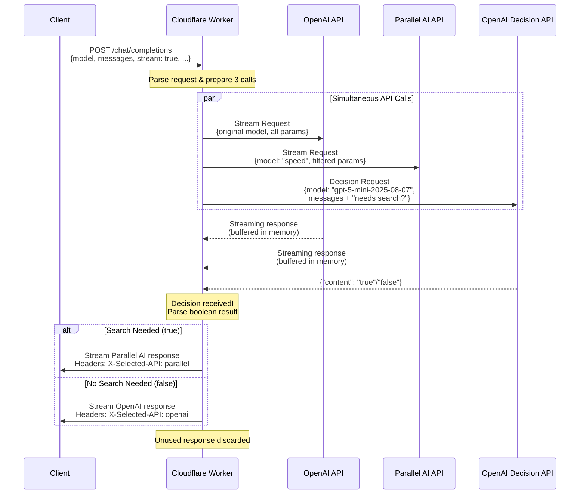
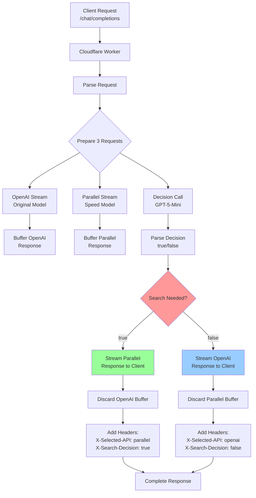

# Chat Proxy Worker

A Cloudflare Worker that intelligently routes chat completion requests between OpenAI and Parallel AI based on whether the query requires web search or real-time information. The TTFT is delayed by the decision prompt, but we instantly stream and buffer both chat completions from the start, such that the TTLT (time to last token) does not change!

Try it:

This should use Parallel Search:

```
curl -s -N -H "Content-Type: application/json" -d '{"model":"gpt-4","messages":[{"role":"user","content":"What is the current weather in New York?"}],"stream":true}' https://maybesearch.p0web.com/chat/completions -i | awk '/^x-/{print} /^data: /{gsub(/^data: /,""); if($0!="[DONE]") {gsub(/[\x00-\x1F]/, "", $0); system("echo '"'"'"$0"'"'"' | jq -r \".choices[0].delta.content // empty\" 2>/dev/null | tr -d \"\\n\"")}}' && echo
```

This should use OpenAI:

```
curl -s -N -H "Content-Type: application/json" -d '{"model":"gpt-4","messages":[{"role":"user","content":"Write a paragraph about the capital of france"}],"stream":true}' https://maybesearch.p0web.com/chat/completions -i | awk '/^x-/{print} /^data: /{gsub(/^data: /,""); if($0!="[DONE]") {gsub(/[\x00-\x1F]/, "", $0); system("echo '"'"'"$0"'"'"' | jq -r \".choices[0].delta.content // empty\" 2>/dev/null | tr -d \"\\n\"")}}' && echo
```



Decision logic:



Timing diagram that shows the performance benefits:

```mermaid path="timing-diagram.mmd"
gantt
    title Proxy Timing vs Sequential Approach
    dateFormat X
    axisFormat %Ls

    section Sequential Approach
    Decision Request    :done, seq1, 0, 500
    Selected API Call   :done, seq2, after seq1, 1000
    Stream Response     :done, seq3, after seq2, 2000
    Total Time         :milestone, after seq3, 0

    section Parallel Proxy Approach
    Decision Request    :done, par1, 0, 500
    OpenAI Stream      :done, par2, 0, 1500
    Parallel Stream    :done, par3, 0, 1500
    Wait for Decision  :done, par4, after par1, 0
    Stream Response    :done, par5, after par4, 1000
    Total Time         :milestone, after par5, 0

    section Time Saved
    Saved Time         :crit, saved, 1500, 500
```



The key benefits shown in these diagrams:

1. **Parallel Execution**: All three API calls happen simultaneously
2. **Smart Buffering**: Both responses are held in memory until decision arrives
3. **Minimal Latency**: Decision determines routing without additional delay
4. **Fallback Handling**: Clear error paths if any API fails
5. **Performance Gain**: ~1-1.5 seconds saved vs sequential approach

The timing diagram shows how your approach reduces total response time from ~3.5s to ~1.5s by running everything in parallel!
