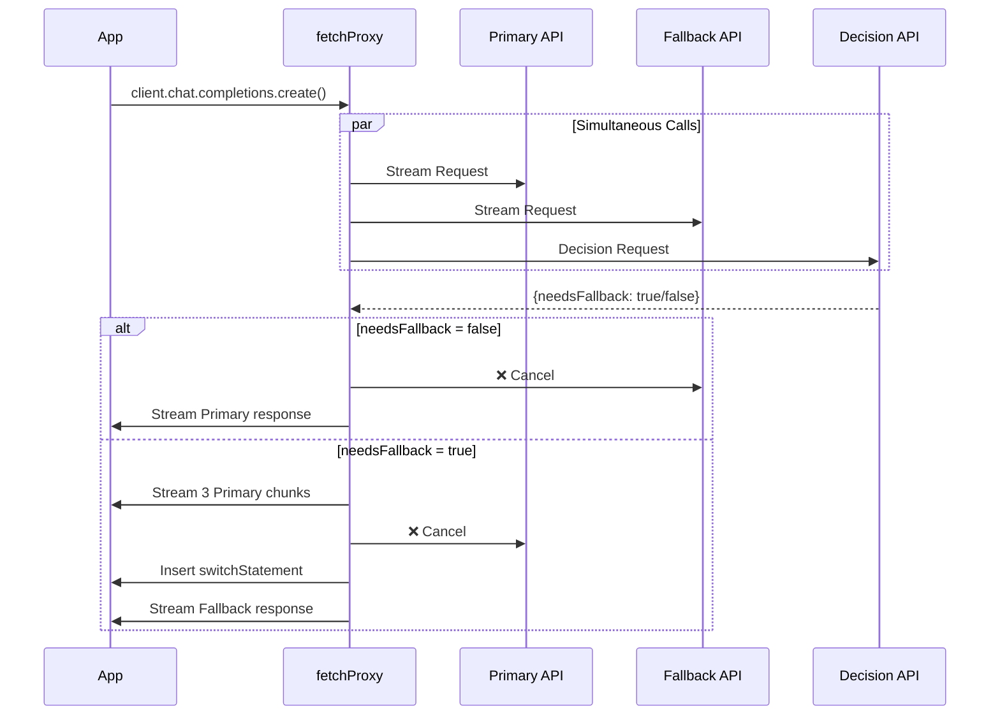

# Speculative Dual Stream Proxy

A TypeScript implementation of speculative dual streaming with immediate cancellation, designed to work with the OpenAI SDK's custom fetch capability.

## Features

- **Custom Fetch Proxy**: Uses `createSpeculativeDualStreamProxy()` to create a fetch function compatible with OpenAI SDK
- **Immediate Cancellation**: Unused stream is canceled as soon as decision is made
- **Mid-Stream Switch**: When fallback is needed, inserts a configurable switch statement
- **TypeScript**: Full type safety with exported types
- **Minimal Buffering**: Fallback response buffered only during brief primary intro

## Usage

### Basic Usage

```typescript
import OpenAI from "openai";
import { createSpeculativeDualStreamProxy } from "./speculative-proxy";

const fetchProxy = createSpeculativeDualStreamProxy({
  decision: {
    model: "gpt-4o-mini-2024-07-18",
    apiKey: process.env.OPENAI_API_KEY!,
    baseURL: "https://api.openai.com/v1",
    prompt:
      "Does this query require web search? Answer only 'true' or 'false'.",
  },
  fallback: {
    model: "speed",
    apiKey: process.env.PARALLEL_API_KEY!,
    baseURL: "https://api.parallel.ai",
    switchStatement: "\n\n[Switching to web search...]\n\n",
  },
});

const client = new OpenAI({
  apiKey: process.env.OPENAI_API_KEY,
  fetch: fetchProxy,
});

// Now all chat completions go through the speculative proxy
const response = await client.chat.completions.create({
  model: "gpt-4",
  messages: [{ role: "user", content: "What's the weather in NYC?" }],
  stream: true,
});

for await (const chunk of response) {
  process.stdout.write(chunk.choices[0]?.delta?.content ?? "");
}
```

### Configuration Options

```typescript
interface SpeculativeDualStreamConfig {
  decision: {
    model: string; // Model to use for decision (e.g., "gpt-4o-mini")
    apiKey: string; // API key for decision endpoint
    baseURL?: string; // Base URL (default: OpenAI)
    prompt: string; // Prompt to determine if fallback is needed
  };
  fallback: {
    model: string; // Model for fallback (e.g., "speed")
    apiKey: string; // API key for fallback endpoint
    baseURL?: string; // Base URL for fallback API
    switchStatement: string; // Message inserted when switching
  };
}
```

## How It Works

1. **Simultaneous Requests**: When a chat completion is requested, the proxy starts:

   - The primary request (original OpenAI call)
   - The fallback request (Parallel AI)
   - The decision request (quick classification)

2. **Decision Point**: Once the decision arrives:

   - If `false`: Cancel fallback immediately, stream primary to completion
   - If `true`: Stream 3 chunks of primary, cancel it, insert switch statement, continue with fallback

3. **Response Headers**: The proxy adds headers to indicate which path was taken:
   - `X-Selected-API`: `primary` or `fallback-switched`
   - `X-Fallback-Decision`: `true` or `false`

## Cloudflare Worker Deployment

```bash
# Install dependencies
npm install

# Development
npm run dev

# Deploy
npm run deploy
```

Set secrets:

```bash
wrangler secret put SECRET
wrangler secret put OPENAI_API_KEY
wrangler secret put PARALLEL_API_KEY
```

## Testing

### Should use primary (OpenAI):

```bash
curl -s -N -H "Authorization: Bearer YOUR_SECRET" \
  -d '{"model":"gpt-4","messages":[{"role":"user","content":"Write about Paris"}],"stream":true}' \
  https://your-worker.workers.dev/chat/completions
```

### Should switch to fallback (Parallel):

```bash
curl -s -N -H "Authorization: Bearer YOUR_SECRET" \
  -d '{"model":"gpt-4","messages":[{"role":"user","content":"What is the current weather in NYC?"}],"stream":true}' \
  https://your-worker.workers.dev/chat/completions
```

## Flow Diagram


